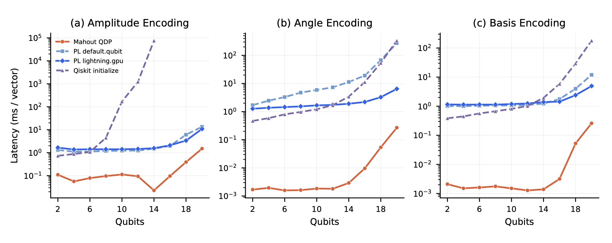
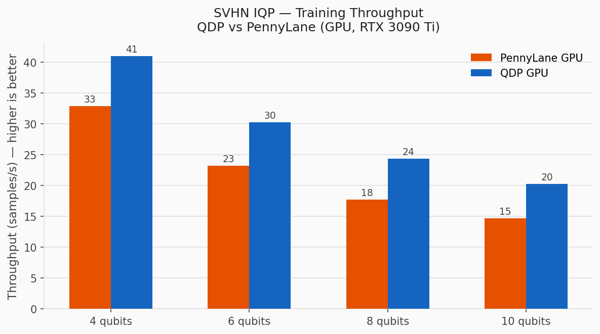
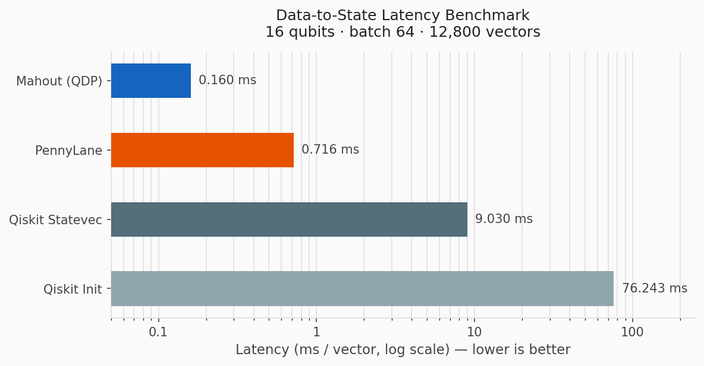
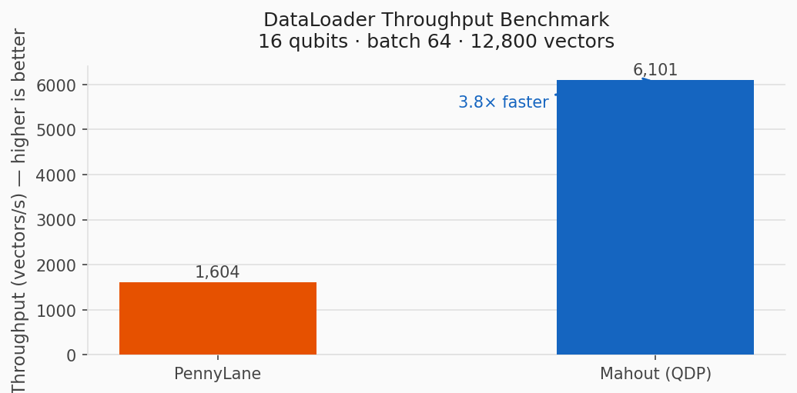

We are excited to announce **QuMat v0.6.0**, the next release of Mahout's quantum machine learning stack.

The main theme of this release is moving QDP from an NVIDIA-focused proof of concept into a broader GPU data plane for quantum ML. QuMat v0.6.0 brings AMD ROCm support to first-class status, closes encoder parity gaps between CUDA and ROCm, adds realistic benchmark workloads, and refreshes the documentation site for users and contributors.

Special thanks to everyone who contributed to this release. We would like to thank PMC members Jie-Kai Chang, Guan-Ming Chiu, Andrew Musselman, Shannon Quinn (PMC Chair) and Trevor Grant. We also thank Committers Hsien-Cheng Huang, and Kuan-Hao Huang, along with contributors Yu-Ting Hsiung (Microsoft), Guan-Hua Wen (Microsoft), An-Te Tsai (Phind), Chao-Hong Yeh (Trend Micro), Han-Wen Tsao, Yu-Chen Lai and the broader Apache Mahout community.

<!-- truncate -->

## What's New in QuMat v0.6.0

QuMat v0.6.0 rolls up 111 pull requests since v0.5.0 and introduces several important changes:

- **AMD ROCm support is now first-class.** QDP can run native AMD GPU encoding paths through hand-written Triton kernels, making ROCm selectable from the same benchmark workflows as CUDA.
- **CUDA and ROCm encoder coverage is now aligned.** Phase, IQP, and IQP-Z encodings now ship on both backends, joining the existing amplitude, angle, and basis paths.
- **QDP adds faster zero-copy and GPU-pointer paths.** Float32 batch encoding, DLPack handoff, async prefetching, and IQP GPU-pointer encoding reduce host-device round trips in hot loops.
- **Benchmarks now exercise realistic workloads.** The release adds SVHN IQP training, SVHN quantum kernel SVM, data-to-state latency, and amplitude DataLoader throughput benchmarks.
- **The documentation and contributor workflow are cleaner.** The docs site now has page frontmatter, self-hosted KaTeX, troubleshooting content, type hints, review guidelines, and a simpler contributor entry point.

Let's look at the major pieces in more detail.

## QDP Encoding Parity Across GPUs

QuMat v0.5.0 introduced QDP as the first public proof of concept for direct state preparation. The goal was to avoid simulating state-preparation circuits just to load classical data into a quantum simulator. Instead, QDP constructs the equivalent state vector directly in GPU memory and exposes it to downstream tools through tensor-friendly interfaces.

QuMat v0.6.0 continues that direction by making the encoding layer more complete and more portable. Before this release, CUDA and AMD ROCm did not have the same encoder coverage, which made direct comparisons difficult and limited ROCm's usefulness in practice.

In v0.6.0, QDP supports the same core encoder set across CUDA and ROCm:

- **Amplitude encoding** for normalized state-vector preparation.
- **Angle encoding** for one-value-per-qubit rotation inputs.
- **Basis encoding** for computational basis states.
- **Phase encoding** for phase-feature preparation.
- **IQP encoding** for entangled feature maps used in quantum ML workflows.
- **IQP-Z encoding** for Z-basis IQP-style feature maps.

On the performance side, this release adds:

- **Float32 zero-copy batch paths** for angle and basis encoders, including both single-sample and batched paths in `qdp-core` and the Python bindings.
- **GPU-pointer encoding** for the IQP family, allowing CUDA tensors to pass through DLPack without a host round trip.
- **IQP kernel fusion and grid-stride optimizations** to reduce kernel launch overhead and improve occupancy.
- **Async prefetching and native f32 dispatch pipelines** to overlap I/O and compute for throughput-bound workloads.



*Figure: Data-to-state latency scaling (ms/vector, log scale) for amplitude, angle, and basis encoding. QDP (orange) achieves orders-of-magnitude lower latency than both CPU and GPU backends.*

## AMD ROCm Support

AMD support is the largest platform change in QuMat v0.6.0. QDP now includes a **Triton AMD engine** (`TritonAmdEngine`) with hand-written Triton kernels that run natively on ROCm. This is Mahout's implementation path, not a wrapper around PennyLane.

The AMD path covers amplitude, angle, basis, phase, IQP, and IQP-Z encodings. It is also selectable from the QDP encoding and throughput benchmarks with:

```bash
--qdp-backend amd
```

PennyLane-AMDGPU (`lightning.amdgpu`) is included in benchmark comparisons as a baseline, but QDP's AMD support does not depend on it.

This release also adds `Dockerfile.qdp-amd`, making it easier to create a reproducible ROCm test environment even when the developer machine is not an AMD GPU host.

For CUDA users, kernel build targets are now configurable. Instead of hard-coding a fixed compute capability list, build-time configuration can target the GPU architectures users actually need, which improves forward compatibility for newer NVIDIA hardware.

## Acknowledgments

The AMD GPU backend in QuMat v0.6.0 was made possible in large part through collaboration with AMD. A special thank-you goes to **AMD Taiwan** and **Mr. Jeffrey Huang** for their crucial support in providing our team with high-performance computing resources.

Access to AMD MI300X hardware was instrumental for contributors working on ROCm support, AMD benchmark coverage, and the broader QDP backend architecture. Their support helped the Apache Mahout community fully explore and enrich the quantum computing capabilities now available in this release.

## Benchmarks for Real QML Workloads

QuMat v0.6.0 adds benchmarks that go beyond synthetic encoder microbenchmarks. The goal is to measure where QDP matters in full or near-full quantum ML workflows: loading data, preparing quantum states, and feeding training or kernel pipelines.

### SVHN IQP Variational Classifier

The SVHN IQP benchmark trains a variational IQP classifier on the Street View House Numbers dataset, using digit 1 versus digit 7 with 200 samples and 200 iterations on two RTX 3090 Ti GPUs.

QDP offloads the IQP encoding step to the GPU in a one-shot pass before training begins. That keeps the training backend independent from encoding cost and makes the data-preparation bottleneck visible.

In this benchmark, QDP GPU outperforms PennyLane GPU at each tested qubit count:

- **4 qubits:** 41 samples/s with QDP GPU versus 33 samples/s with PennyLane GPU.
- **10 qubits:** 20 samples/s with QDP GPU versus 15 samples/s with PennyLane GPU.



### SVHN Quantum Kernel SVM

The SVHN Quantum Kernel SVM benchmark runs a precomputed squared inner-product quantum kernel SVM on SVHN amplitude-encoded features at 12 qubits. It measures the end-to-end path from raw pixels to SVM prediction:

```text
feature encoding -> kernel matrix -> SVM fit/predict
```

This is important because it exercises the whole pipeline rather than just the encoding step.

### Data-to-State Latency

The data-to-state benchmark isolates the path from CPU RAM to a GPU-ready quantum state at 16 qubits, using 65,536-dimensional vectors.

Mahout QDP reaches **0.160 ms/vector** in this benchmark:

- **4.5x faster than PennyLane** at 0.716 ms/vector.
- **56x faster than Qiskit Statevector** at 9.030 ms/vector.
- **477x faster than Qiskit Initialize** at 76.243 ms/vector.

PennyLane and Mahout both target GPU in this comparison. The Qiskit baselines run on CPU, with Qiskit Initialize also paying circuit decomposition and transpilation overhead.



### DataLoader Amplitude Throughput

The DataLoader benchmark streams 12,800 amplitude-encoded vectors in batches of 64 at 16 qubits.

Mahout QDP reaches **6,101 vectors/s**, compared with **1,604 vectors/s** for PennyLane. That is a **3.8x throughput improvement** for this data-loading workload.



All QDP benchmarks can select the AMD backend with `--qdp-backend amd`, enabling direct CUDA-vs-ROCm comparisons on the same workload.

## Installing QuMat with QDP

The base QuMat package can be installed as usual:

```bash
pip install qumat==0.6.0
```

To install QuMat with QDP support:

```bash
pip install "qumat[qdp]==0.6.0"
```

This installs `qumat 0.6.0` and resolves the QDP native extension package, `qumat-qdp 0.2.0`. As in v0.5.0, these are intentionally different package versions: QuMat is the top-level Mahout quantum ML package, while `qumat-qdp` is the separately published native extension behind the `qdp` extra.

The accelerated QDP path requires a compatible GPU runtime. The CUDA path targets Linux x86_64 with NVIDIA CUDA. The AMD path targets ROCm through the Triton AMD engine and is intended for ROCm-capable Linux environments.

## Documentation and Developer Workflow

This release also improves the project around the code. The docs site and contributor workflow received a broad cleanup:

- **Frontmatter on documentation pages** so Docusaurus can generate cleaner metadata.
- **Self-hosted KaTeX** so math rendering works offline and no longer depends on a CDN.
- **A troubleshooting guide** for common install, GPU detection, CUDA, and ROCm issues.
- **CONTRIBUTING content merged into the README** so new contributors have fewer entry points to check.
- **Python type hints in QuMat** as a first step toward better IDE support and static analysis.
- **PR policy and review guidelines** documenting merge criteria and review expectations.
- **Expanded Ruff rules and type-checking CI** to keep new code more consistent.
- **pytest-xdist support** to reduce CI wall-clock time on multi-core runners.

## Other Improvements

QuMat v0.6.0 also includes several smaller but useful improvements:

- **Cloud storage support** for QDP data loading from S3 and GCS remote URLs in addition to local paths.
- **Encoding and dtype enums** so Python callers can use structured values instead of bare strings.
- **Pure-PyTorch reference implementations** for correctness comparison and CPU fallback.
- **Configurable CUDA kernel targets** for better hardware compatibility.
- **More benchmark controls** for comparing QDP, PennyLane, Qiskit, CUDA, and ROCm paths.

## What's Next

QuMat v0.6.0 makes QDP a broader GPU data plane rather than a single-vendor acceleration path. The next steps are to harden the CUDA and ROCm implementations, expand benchmark coverage, improve packaging for GPU-specific environments, and continue building end-to-end QML examples that show how QDP fits into real training and kernel workflows.

The QDP roadmap after this release focuses on:

- More backend validation across NVIDIA and AMD GPU families.
- Broader benchmark coverage for realistic quantum ML datasets.
- Better documentation for choosing CUDA, ROCm, and CPU fallback paths.
- Continued improvements to zero-copy tensor handoff and batched data loading.
- More complete examples that connect QuMat circuits, QDP encoding, and downstream training code.

## Links

- Apache downloads: https://downloads.apache.org/mahout/0.6/
- QuMat PyPI: https://pypi.org/project/qumat/0.6.0/
- QDP PyPI: https://pypi.org/project/qumat-qdp/0.2.0/
- Release tag: https://github.com/apache/mahout/releases/tag/mahout-qumat-0.6.0
- Docs: https://mahout.apache.org/

We welcome feedback and contributions on the [dev@mahout.apache.org](mailto:dev@mahout.apache.org) mailing list and on [GitHub](https://github.com/apache/mahout).
