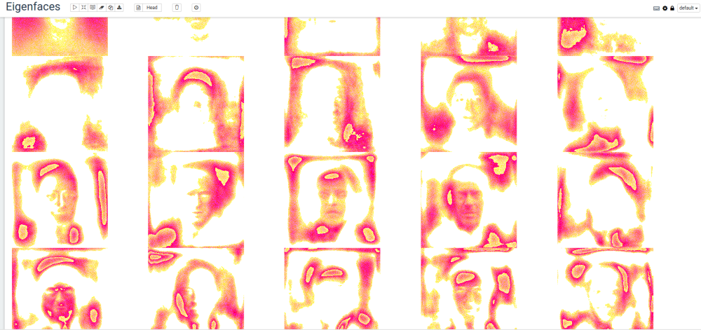

<!--
 Licensed to the Apache Software Foundation (ASF) under one or more
 contributor license agreements.  See the NOTICE file distributed with
 this work for additional information regarding copyright ownership.
 The ASF licenses this file to You under the Apache License, Version 2.0
 (the "License"); you may not use this file except in compliance with
 the License.  You may obtain a copy of the License at

     http://www.apache.org/licenses/LICENSE-2.0

 Unless required by applicable law or agreed to in writing, software
 distributed under the License is distributed on an "AS IS" BASIS,
 WITHOUT WARRANTIES OR CONDITIONS OF ANY KIND, either express or implied.
 See the License for the specific language governing permissions and
 limitations under the License.
-->
---
layout: doc-page
title: Eigenfaces Demo

   
---

*Credit: [original blog post by rawkintrevo](https://rawkintrevo.org/2016/11/10/deep-magic-volume-3-eigenfaces/). This will be maintained through version changes, blog post will not.*

*Eigenfaces* are an image equivelent(ish) to *eigenvectors* if you recall your high school linear algebra classes. If you don't recall: [read wikipedia](https://en.wikipedia.org/wiki/Eigenvalues_and_eigenvectors) otherwise, it is a set of 'faces' that by a linear combination can be used to represent other faces.

Their are lots of "image recognition" things out there right now, and deep learning is the popular one everyone is talking about.
Deep learning will admittedly do better a recognizing and correctly classifying faces, however it does so at a price.
1. Neural networks are very costly to train in the first place
1. Everytime a new person is added, the neural network must be retrained to recognize the new person

The advantage/use-case for the eigenfaces approach is when new faces are being regularly added. Even when building a production
grade eigenfaces based system- neural networks still have a place- _idenitifying faces_ in images, and creating _centered and scaled_ images around
the face.  This is scalable because we only need to train our neural network to detect, center, and scale faces once.  E.g. 
a neural network would be deployed as a microservice, and then eigenfaces would be deployed as a microservice.

A production version ends up looking something like this:
- Image comes in- is fed to 'detect faces, center, scale- neural network based microservice'
- Neural network microservice detects faces, centers and scales.  Passes each face to eigenfaces microservice
- For each face:<br>
    a. Decompose face into linear combination of eigenfaces<br>
    b. Determine if linear combination vector is close enough to any exististing vector to declare a match <br>
    c. If no match "add new person" to face corpus. 

### Get the data

The first thing we're going to do is collect a set of 13,232 face images (250x250 pixels) from the <a href="http://vis-www.cs.umass.edu/lfw/">Labeled Faces in the Wild</a> data set.

    cd /tmp
    mkdir eigenfaces
    wget http://vis-www.cs.umass.edu/lfw/lfw-deepfunneled.tgz
    tar -xzf lfw-deepfunneled.tgz

### Load dependencies

    cd $MAHOUT_HOME/bin
    ./mahout spark-shell \
        --packages com.sksamuel.scrimage:scrimage-core_2.10:2.1.0, \
        com.sksamuel.scrimage:scrimage-io-extra_2.10:2.1.0, \
        com.sksamuel.scrimage:scrimage-filters_2.10:2.1.0
    


### Create a DRM of Vectorized Images

```scala
import com.sksamuel.scrimage._
import com.sksamuel.scrimage.filter.GrayscaleFilter

val imagesRDD:DrmRdd[Int] = sc.binaryFiles("/tmp/lfw-deepfunneled/*/*", 500)
       .map(o => new DenseVector( Image.apply(o._2.toArray)
       .filter(GrayscaleFilter)
       .pixels
       .map(p => p.toInt.toDouble / 10000000)) )
   .zipWithIndex
   .map(o => (o._2.toInt, o._1))

val imagesDRM = drmWrap(rdd= imagesRDD).par(min = 500).checkpoint()

println(s"Dataset: ${imagesDRM.nrow} images, ${imagesDRM.ncol} pixels per image")
```

### Mean Center the Images

```scala
import org.apache.mahout.math.algorithms.preprocessing.MeanCenter


val scaler: MeanCenterModel = new MeanCenter().fit(imagesDRM)

val centeredImages = scaler.transform(imagesDRM)
```


### Calculate the Eigenimages via DS-SVD

```scala
import org.apache.mahout.math._
import decompositions._
import drm._

val(drmU, drmV, s) = dssvd(centeredImages, k= 20, p= 15, q = 0)
```

### Write the Eigenfaces to Disk

```scala
import java.io.File
import javax.imageio.ImageIO

val sampleImagePath = "/home/guest/lfw-deepfunneled/Aaron_Eckhart/Aaron_Eckhart_0001.jpg"
val sampleImage = ImageIO.read(new File(sampleImagePath))  
val w = sampleImage.getWidth
val h = sampleImage.getHeight

val eigenFaces = drmV.t.collect(::,::)
val colMeans = scaler.colCentersV

for (i <- 0 until 20){
    val v = (eigenFaces(i, ::) + colMeans) * 10000000
    val output = new Array[com.sksamuel.scrimage.Pixel](v.size)
    for (i <- 0 until v.size) {
        output(i) = Pixel(v.get(i).toInt)
    }
    val image = Image(w, h, output)
    image.output(new File(s"/tmp/eigenfaces/${i}.png"))
}
```

### View the Eigenfaces

If using Zeppelin, the following can be used to generate a fun table of the Eigenfaces:

```python
%python
 
r = 4
c = 5
print '%html\n<table style="width:100%">' + "".join(["<tr>" + "".join([ '<td></td>' % (i + j) for j in range(0, c) ]) + "</tr>" for i in range(0, r * c, r +1 ) ]) + '</table>'

```

