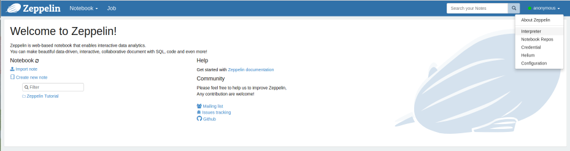

<!--
 Licensed to the Apache Software Foundation (ASF) under one or more
 contributor license agreements.  See the NOTICE file distributed with
 this work for additional information regarding copyright ownership.
 The ASF licenses this file to You under the Apache License, Version 2.0
 (the "License"); you may not use this file except in compliance with
 the License.  You may obtain a copy of the License at

     http://www.apache.org/licenses/LICENSE-2.0

 Unless required by applicable law or agreed to in writing, software
 distributed under the License is distributed on an "AS IS" BASIS,
 WITHOUT WARRANTIES OR CONDITIONS OF ANY KIND, either express or implied.
 See the License for the specific language governing permissions and
 limitations under the License.
-->
---
layout: doc-page
title: Visualizing Mahout in Zeppelin

    
---

The [Apache Zeppelin](http://zeppelin.apache.org) is an exciting notebooking tool, designed for working with Big Data
applications.  It comes with great integration for graphing in R and Python, supports multiple langauges in a single 
notebook (and facilitates sharing of variables between interpreters), and makes working with Spark and Flink in an interactive environment (either locally or in cluster mode) a 
breeze.  Of course, it does lots of other cool things too- but those are the features we're going to take advantage of.

### Step1: Download and Install Zeppelin

Zeppelin binaries by default use Spark 2.1 / Scala 2.11, until Mahout puts out Spark 2.1/Scala 2.11 binaries you have
two options. 

#### Option 1: Build Mahout for Spark 2.1/Scala 2.11

**Build Mahout**

Follow the standard procedures for building Mahout, except manually set the Spark and Scala versions - the easiest way being:
    
    git clone http://github.com/apache/mahout
    cd mahout
    mvn clean package -Dspark.version=2.1.0 -Dscala.version=2.11.8 -Dscala.compat.version=2.11 -DskipTests
    

**Download Zeppelin**

    cd /a/good/place/to/install/
    wget http://apache.mirrors.tds.net/zeppelin/zeppelin-0.7.1/zeppelin-0.7.1-bin-all.tgz
    tar -xzf zeppelin-0.7.1-bin-all.tgz
    cd zeppelin*
    bin/zeppelin-daemon.sh start

And that's it. Open a web browser and surf to [http://localhost:8080](http://localhost:8080)

Proceed to Step 2.

#### Option2: Build Zeppelin for Spark 1.6/Scala 2.10

We'll use Mahout binaries from Maven, so all you need to do is clone, and build Zeppelin-

    git clone http://github.com/apache/zeppelin
    cd zeppelin
    mvn clean package -Pspark1.6 -Pscala2.10 -DskipTests

After it builds successfully...

    bin/zeppelin-daemon.sh start
    
And that's it. Open a web browser and surf to [http://localhost:8080](http://localhost:8080)

### Step2: Create the Mahout Spark Interpreter

After opening your web browser and surfing to [http://localhost:8080](http://localhost:8080), click on the `Anonymous` 
button on the top right corner, which will open a drop down. Then click `Interpreter`.

At the top right, just below the blue nav bar- you will see two buttons, "Repository" and "+Create".  Click on "+Create"

The following screen should appear.

In the **Interpreter Name** enter `mahoutSpark` (you can name it whatever you like, but this is what we'll assume you've
named it later in the tutorial)

In the **Interpreter group** drop down, select `spark`. A bunch of other settings will now auto-populate.

Scroll to the bottom of the **Properties** list. In the last row, you'll see two blank boxes. 

Add the following properies by clicking the "+" button to the right.

<table class="table">
    <tr>
        <th>name</th>
        <th>value</th>
    </tr>
    <tr>
        <td>spark.kryo.referenceTracking</td>
        <td>false</td>
    </tr>
    <tr>
        <td>spark.kryo.registrator</td>
        <td>org.apache.mahout.sparkbindings.io.MahoutKryoRegistrator</td>
    </tr>
    <tr>
        <td>spark.kryoserializer.buffer</td>
        <td>32</td>
    </tr>
    <tr>
        <td>spark.kryoserializer.buffer.max</td>
        <td>600m</td>
    </tr>    
    <tr>
        <td>spark.serializer</td>
        <td>org.apache.spark.serializer.KryoSerializer</td>
    </tr> 
</table>

### Step 3: Add Dependendencies
You'll also need to add the following **Dependencies**.

#### If you chose Option1 in Step 1:

Where `/path/to/mahout` is the path to the directory where you've built mahout.

<table class="table">
    <tr>
        <th>artifact</th>
        <th>exclude</th>
    </tr>
    <tr>
        <td>/path/to/mahout/core_2.11-0.14.jar</td>
        <td></td>
    </tr>
     <tr>
        <td>path/to/mahout/mahout-hdfs_2.11-0.14.jar</td>
        <td></td>
     </tr>
    <tr>
        <td>/path/to/mahout/mahout-spark_2.11-0.14.jar</td>
        <td></td>
    </tr>  
    <tr>
        <td>/path/to/mahout/mahout-spark_2.11-0.14.jar-dependeny-reduced.jar</td>
        <td></td>
    </tr>
</table>

#### If you chose Option2 in Step 1: 

<table class="table">
    <tr>
        <th>artifact</th>
        <th>exclude</th>
    </tr>
    <tr>
        <td>org.apache.mahout:mahout-core:0.14</td>
        <td></td>
    </tr>
    <tr>
        <td>org.apache.mahout:mahout-hdfs-scala_2.11:0.14</td>
        <td></td>
    </tr>
    <tr>
        <td>org.apache.mahout:mahout-spark_2.11:0.14</td>
        <td></td>
    </tr>
     <tr>
         <td>org.apache.mahout:mahout-native-viennacl-omp_2.11:0.14</td>
         <td></td>
     </tr> 

</table>

_**OPTIONALLY**_ You can add **one** of the following artifacts for CPU/GPU acceleration.

<table class="table">
    <tr>
        <th>artifact</th>
        <th>exclude</th>
        <th>type of native solver</th>
    </tr>
     <tr>
         <td>org.apache.mahout:mahout-native-viennacl_2.11:0.14</td>
         <td></td>
         <td>ViennaCL GPU Accelerated</td>
     </tr> 
     <tr>
         <td>org.apache.mahout:mahout-native-viennacl-omp_2.11:0.14</td>
         <td></td>
         <td>ViennaCL-OMP CPU Accelerated (use this if you don't have a good graphics card)</td>
     </tr> 
</table>

Make sure to click "Save" and you're all set. 

### Step 4. Rock and Roll.

Mahout in Zeppelin, unlike the Mahout Shell, won't take care of importing the Mahout libraries or creating the 
`MahoutSparkContext`, we need to do that manually. This is easy though.  When ever you start Zeppelin (or restart) the 
Mahout interpreter, you'll need to run the following code first:

    %sparkMahout
    
    import org.apache.mahout.math._
    import org.apache.mahout.math.scalabindings._
    import org.apache.mahout.math.drm._
    import org.apache.mahout.math.scalabindings.RLikeOps._
    import org.apache.mahout.math.drm.RLikeDrmOps._
    import org.apache.mahout.sparkbindings._
    
    implicit val sdc: org.apache.mahout.sparkbindings.SparkDistributedContext = sc2sdc(sc)
    

At this point, you have a Zeppelin Interpreter which will behave like the `$MAHOUT_HOME/bin/mahout spark-shell`
  
Except, much much more.

At the begining I mentioned a few important features of Zeppelin, that we could leverage to use Zeppelin for visualizatoins.

#### Example 1: Visualizing a Matrix (Sample) with R

In Mahout we can use `Matrices.symmetricUniformView` to create a Gaussian Matrix. 

We can use `.mapBlock` and some clever code to create a 3D Gausian Matrix. 

We can use `.drmSampleToTsv` to take a sample of the matrix and turn it in to a tab seperated string. We take a sample of 
 the matrix because, since we are dealing with "big" data, we wouldn't want to try to collect and plot the entire matrix, 
 however, IF we knew we had a small matrix and we DID want to sample the entire thing, then we could sample `100.0` e.g. 100%.
 
Finally we use `z.put(...)` to put a variable into Zeppelin's `ResourcePool` a block of memory shared by all interpreters. 

    %sparkMahout
    
    val mxRnd3d = Matrices.symmetricUniformView(5000, 3, 1234)
    val drmRand3d = drmParallelize(mxRnd3d)
    
    val drmGauss = drmRand3d.mapBlock() {case (keys, block) =>
      val blockB = block.like()
      for (i <- 0 until block.nrow) {
        val x: Double = block(i, 0)
        val y: Double = block(i, 1)
        val z: Double = block(i, 2)
    
        blockB(i, 0) = x
        blockB(i, 1) = y
        blockB(i, 2) = Math.exp(-((Math.pow(x, 2)) + (Math.pow(y, 2)))/2)
      }
      keys -> blockB
    }
    
    resourcePool.put("gaussDrm", drm.drmSampleToTSV(drmGauss, 50.0))
    
Here we sample 50% of the matrix and put it in the `ResourcePool` under a variable named "gaussDrm".

Now, for the exciting part. Scala doesn't have a lot of great graphing utilities. But you know who does? R and Python. So
instead of trying to akwardly visualize our data using Scala, let's just use R and Python. 

We start the Spark R interpreter (we do this because the regular R interpreter doesn't have access to the resource pools).

We `z.get` the variable we just put in. 

We use R's `read.table` to read the string- this is very similar to how we would read a tsv file in R. 

Then we plot the data using the R `scatterplot3d` package. 

**Note** you may need to install `scatterplot3d`. In Ubuntu, do this with `sudo apt-get install r-cran-scatterplot3d`

    %spark.r {"imageWidth": "400px"}
    
    library(scatterplot3d)
    
    
    gaussStr = z.get("gaussDrm")
    data <- read.table(text= gaussStr, sep="\t", header=FALSE)
    
    scatterplot3d(data, color="green")

