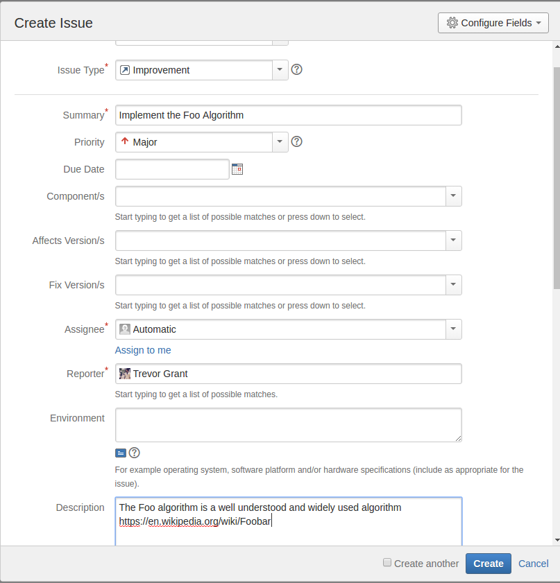
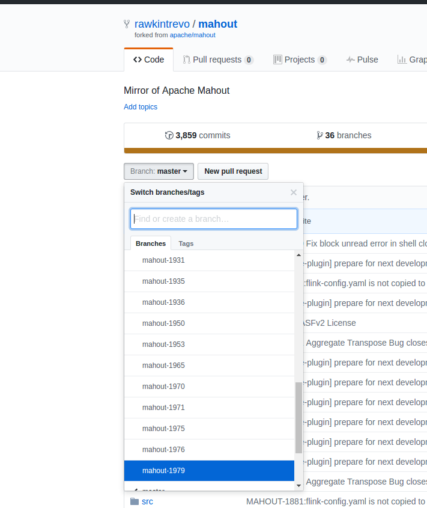

The Mahout community is driven by user contribution.  If you have implemented an algorithm and are interested in 
sharing it with the rest of the community, we highly encourage you to contribute it to the codebase.  However to
keep things from getting too out of control, we have instituted a standard API for our algorithms, and we ask you 
contribute your algorithm in a way that conforms to this API as much as possible.  You can always reach out on 
[dev@mahout.apache.org](dev@mahout.apache.org) if you need help.

In this example, let's say you've created a totally new algorithm- a regression algorithm called `Foo`

The `Foo` algorithm is a silly algorithm- it always guesses the target is 1. Not at all useful as an algorithm, but great for
illustrating how an algorithm would be added.

## Step 1: Create  JIRA ticket

Go to [the Mahout JIRA board](https://issues.apache.org/jira/browse/MAHOUT/) and click the red "Create" button. 

If you don't see the button, you may need to be granted contributor rights on the JIRA board.  Send a message to [dev@mahout.apache.org](dev@mahout.apache.org) and someone will add you.
 
Once you click "Create" a dialog box will pop up. 
 
In the Summary box write a short description, something like `Implement Foo Algorithm`

Under assignee- click "Assign to Me", this lets everyone know you're working on the algorithm.
 
In the description, it would be good to describe the algorithm, and if possible link to a Wikipedia article about the algorithm/method or better yet an academic journal article.

Once you've creted- a JIRA number will be assigned.  For example, here is the JIRA ticket for me writing this tutorial. 

This is MAHOUT-1980.  Whatever number your new issue is assigned, we'll refer to as XXXX for the rest of the tutorial.

## Step 2. Clone Mahout and create branch

Supposing you don't already have a copy of Mahout on your computer open a terminal and type the following
   
    git clone http://github.com/apache/mahout
    
This will clone the Mahout source code into a directory called `mahout`.  Go into that directory and create a new branch called
`mahout-xxxx` (where `xxxx` is your JIRA number from step 1)
    
    cd mahout
    git checkout -b mahout-xxxx

## Step 3. Create Classes for your new Algorithm

**NOTE** I am using IntelliJ Community-Edition as an IDE.  There are several good IDEs that exist, and I _highly_ reccomend
you use one, but you can do what you like.  As far as screen shots go though, that is what I'm working with here.

Create a file `mahout/math-scala/src/main/scala/org/apache/mahout/math/algorithms/regression/FooModel.scala`

The first thing to add to the file is a license:
    
    /**
      * Licensed to the Apache Software Foundation (ASF) under one
      * or more contributor license agreements. See the NOTICE file
      * distributed with this work for additional information
      * regarding copyright ownership. The ASF licenses this file
      * to you under the Apache License, Version 2.0 (the
      * "License"); you may not use this file except in compliance
      * with the License. You may obtain a copy of the License at
      *
      * http://www.apache.org/licenses/LICENSE-2.0
      *
      * Unless required by applicable law or agreed to in writing,
      * software distributed under the License is distributed on an
      * "AS IS" BASIS, WITHOUT WARRANTIES OR CONDITIONS OF ANY
      * KIND, either express or implied. See the License for the
      * specific language governing permissions and limitations
      * under the License.
      */
      
The next thing to add to the file is the `package` statement. 

    package org.apache.mahout.math.algorithms.regression
    
And finally declare the Fitter and Model classes

    class Foo extends RegressorFitter {
    
    }
    
    class FooModel extends RegressorModel {
    
    }
    

The Fitter class holds the methods for fitting which returns a Model, the Model class hold the parameters for the model and 
 methods for using on new data sets. In a RegressorModel that is going to be a `predict()` method.
  
In your algorithm, most of your code is going to go into the `.fit` method. Since this is just a silly example, we're 
 don't really have anything to fit- so we're just going to return a FooModel (because that is what the Fitter must do)
 
    class Foo[K] extends RegressorFitter[K] {
    
      def fit(drmX  : DrmLike[K],
              drmTarget: DrmLike[K],
              hyperparameters: (Symbol, Any)*): FooModel[K] ={
        /**
          * Normally one would have a lot more code here.
          */

        var model = new FooModel[K]
        model.summary = "This model has been fit, I would tell you more interesting things- if there was anything to tell."
        model
      }
    }
    
    class FooModel[K] extends RegressorModel[K] {
    
      def predict(drmPredictors: DrmLike[K]): DrmLike[K] = {
        drmPredictors.mapBlock(1) {
          case (keys, block: Matrix) => {
            var outputBlock = new DenseMatrix(block.nrow, 1)
            keys -> (outputBlock += 1.0)
          }
        }
      }
    }

I've also added something to the summary string. It wasn't a very helpful thing, but this isn't a very helpful algorithm. I included
as a reminder to you, the person writing a useful algorithm, that this is a good place to talk about the results of the fitting.

At this point it would be reasonable to try building Mahout and checking that your algorithm is working the way you expect it to

    mvn clean package -DskipTests
    
I like to use the Mahout Spark-Shell for cases like this.

    cd $MAHOUT_HOME/bin
    ./mahout spark-shell
    
Then once I'm in the shell:

    import org.apache.mahout.math.algorithms.regression.Foo
    
    val drmA = drmParallelize(dense((1.0, 1.2, 1.3, 1.4), (1.1, 1.5, 2.5, 1.0), (6.0, 5.2, -5.2, 5.3), (7.0,6.0, 5.0, 5.0), (10.0, 1.0, 20.0, -10.0)))
    
    val model = new Foo().fit(drmA(::, 0 until 2), drmA(::, 2 until 3))
 
    model.predict(drmA).collect
    
And everything seems to be in order. 

    res5: org.apache.mahout.math.Matrix =
    {
     0 =>   {0:1.0}
     1 =>   {0:1.0}
     2 =>   {0:1.0}
     3 =>   {0:1.0}
     4 =>   {0:1.0}
    }
    
## Step 4. Working with Hyper Parameters

It's entirely likely you'll need to have hyper-parameters to tune your algorithm. 

In Mahout we handle these with a map of Symbols. You might have noticed in the `fit` and `predict` methods we included 
`hyperparameters: (Symbol, Any)*`

Well let's look at how we would work with those.

Suppose instead of always guessing "1.0" we wanted to guess some user defined number (a very silly algorithm). 

We'll be adding a parameter called `guessThisNumber` to the Fitter method. By convention, we usually create a function in 
the fitter called `setStandardHyperparameters` and let that take care of setting up all of our hyperparameters and then call
that function inside of fit. This keeps things nice and clean. 

    class Foo[K] extends RegressorFitter[K] {
    
      var guessThisNumber: Double = _
    
      def setStandardHyperparameters(hyperparameters: Map[Symbol, Any] = Map('foo -> None)): Unit = {
        guessThisNumber = hyperparameters.asInstanceOf[Map[Symbol, Double]].getOrElse('guessThisNumber, 1.0)
      }
      def fit(drmX  : DrmLike[K],
              drmTarget: DrmLike[K],
              hyperparameters: (Symbol, Any)*): FooModel[K] ={
        /**
          * Normally one would have a lot more code here.
          */
    
        var model = new FooModel[K]
    
        setStandardHyperparameters(hyperparameters.toMap)
        model.guessThisNumber = guessThisNumber
        model.summary = s"This model will always guess ${model.guessThisNumber}"
        model
      }
    }
    
Also notice we set the _default value_ to 1.0.  We also now have something to add into the summary string.

To implement this, we'll need to broadcast the guessed number in the `predict` method.  In Mahout you can only broadcast
`Vectors` and `Matrices`.  We use `drmBroadcast` It might be tempting to use the broadcast method of the underlying engine, but 
this is a no-no.  The reason for this is that we want to keep our algorithm abstracted over multiple distributed engines. 

    class FooModel[K] extends RegressorModel[K] {
    
      var guessThisNumber: Double = _
    
      def predict(drmPredictors: DrmLike[K]): DrmLike[K] = {
    
        // This is needed for MapBlock
        implicit val ktag =  drmPredictors.keyClassTag
    
        // This is needed for broadcasting
        implicit val ctx = drmPredictors.context
        
        val bcGuess = drmBroadcast(dvec(guessThisNumber))
        drmPredictors.mapBlock(1) {
          case (keys, block: Matrix) => {
            var outputBlock = new DenseMatrix(block.nrow, 1)
            keys -> (outputBlock += bcGuess.get(0))
          }
        }
      }
    }
    
We can get pretty creative with what sort of information we can send out in the broadcast even when it's just Vectors and Matrices

Here we get the single number we need by broadcasting it in a length 1 vector.  We then `get` our number from that position.

    keys -> (outputBlock += bcGuess.get(0))
    

Let's open up the `$MAHOUT_HOME/bin/mahout spark-shell` and try out the hyperparameter

    import org.apache.mahout.math.algorithms.regression.Foo
        
    val drmA = drmParallelize(dense((1.0, 1.2, 1.3, 1.4), (1.1, 1.5, 2.5, 1.0), (6.0, 5.2, -5.2, 5.3), (7.0,6.0, 5.0, 5.0), (10.0, 1.0, 20.0, -10.0)))
    
    val model = new Foo().fit(drmA(::, 0 until 2), drmA(::, 2 until 3), 'guessThisNumber -> 2.0)
 
    model.predict(drmA).collect

## Step 5. Unit Tests

Ahh unit tests, so tedious but so important.  We want to create a unit test that will break if someone changes some other code
that causes our algorithm to fail (or guess the wrong numbers)

By convention, if an algorithm has been written in R it is best to make a very small sample data set, and run the R version
of the algorithm- and then verify your algorithm generates the same results, or explain why it there is divergence.

Since no one has implemented Foo in any other packages however, we will have to be very sure our algorithm correct by doing
it by hand in R, and in a way others can verify.  Actually- I'm not making a prototype of the Foo algorithm, but I do want to impress
that it _is_ very important that you do, so that the person reviewing the PR can verify your results. (Maybe there is an example 
in the paper you read).

Since this is a regression model, open up 

    $MAHOUT_HOME/math-scala/src/test/scala/org/apache/mahout/math/algorithms/RegressionSuiteBase.scala
    
You'll see some other tests in there to get you started. You'll also see some R-Prototypes, and in the case of `cochrane orcutt` 
where the R implementation had divergent results and my argument for why our algorithm was right. 

I'm going to create a new test called `foo test` and I'm going to build it similar to the example I've been using.

    test("foo") {
        import org.apache.mahout.math.algorithms.regression.Foo
    
        val drmA = drmParallelize(dense((1.0, 1.2, 1.3, 1.4),
                                        (1.1, 1.5, 2.5, 1.0),
                                        (6.0, 5.2, -5.2, 5.3),
                                        (7.0,6.0, 5.0, 5.0),
                                        (10.0, 1.0, 20.0, -10.0)))
    
        val model = new Foo().fit(drmA(::, 0 until 2), drmA(::, 2 until 3), 'guessThisNumber -> 2.0)
    
        val myAnswer = model.predict(drmA).collect
        val correctAnswer = dense( (2.0),
                                    (2.0),
                                    (2.0),
                                    (2.0),
                                    (2.0))
    
    
        val epsilon = 1E-6
        (myAnswer - correctAnswer).sum should be < epsilon
      }
      
Note the use of `epsilon`.  The answer really _should be_ 0.0. But, especially for more complicated algorithms, we allow 
for a touch of machine rounding error.

Now build and check your tests by building without skipping the tests

    mvn clean package
    
## Step 6. Add documentation to the website. 

Now you've created this awesome algorithm- time to do a little marketing!  Create the following file:

    $MAHOUT_HOME/website/docs/algorithms/regression/foo.md

In that file create a blank Jekyll template:
    
    ---
    layout: algorithm
    title: Foo
    theme:
        name: mahout2
    ---
    
    ### About
    
    Foo is a very famous and useful algorithm. Let me tell you lots about it...
    
    [A mark down link](https://en.wikipedia.org/wiki/Foobar)
    
    ### Parameters
    
    

      <table class="table">
        <tr>
            <th>Parameter</th>
            <th>Description</th>
            <th>Default Value</th>
        </tr>
        <tr>
            <td><code>'guessThisNumber</code></td>
            <td>The number to guess</td>
            <td><code>1.0</code></td>
        </tr>
        </table>
        

    
    ### Example
    import org.apache.mahout.math.algorithms.regression.Foo
            
    val drmA = drmParallelize(dense((1.0, 1.2, 1.3, 1.4), (1.1, 1.5, 2.5, 1.0), (6.0, 5.2, -5.2, 5.3), (7.0,6.0, 5.0, 5.0), (10.0, 1.0, 20.0, -10.0)))
    
    val model = new Foo().fit(drmA(::, 0 until 2), drmA(::, 2 until 3), 'guessThisNumber -> 2.0)
 
    model.predict(drmA).collect

The firse few lines between the `---` is the header, this has the title and tells Jekyll what sort of page this is, it knows 
elsewhere based on that, how to compile the page (add navbars, etc).

The _About_ section, is your chance to really dive into the algorithm and its implementation. More is more. If you didn't have an 
R prototype in the unit tests (or have a divergent answer from R) this is a good place to really expand on that.
 
The _Parameters_ section is a good reference for users to know that the hyperparameters are and what they do.

The _Example_ section is a quick little example to get users started. You may have noticed I used the same code I used in 
the unit test.  That's something I do often, but there is no reason you have to. If you want to come up with a more illustrative example 
(or several illustrative examples) that's encouraged.
Add links to the nav-bars

    $MAHOUT_HOME/website/docs/_includes/algo_navbar.html
    $MAHOUT_HOME/website/docs/_includes/navbar.html

You can look at the links already in there, but it's going to look something like

    <li> <a href="{{ BASE_PATH }}/algorithms/regression/Foo.html">Foo</a></li>

Jeckyll will convert your *.md file into *.html at the same place on the directory tree.

To check that your webpage look right:

    cd $MAHOUT_HOME/website/docs
    jeckyll --serve

Then open a webbrowser and go to [http://localhost:4000](http://localhost:4000)

If you're feeling really froggy- you're also welcome to add a tutorial :)

## Step 7. Commit Changes, Push to Github, and Open a PR

Open a terminal, return to the `mahout` top directory and type
    
    git status
    
You'll see `Changes not staged for commit`.  

Any file you touched will be listed there, but we only want to stage the files we were in. 

For this tutorial it was

    git add mahout/math-scala/src/main/scala/org/apache/mahout/math/algorithms/regression/FooModel.scala
    git add math-scala/src/test/scala/org/apache/mahout/math/algorithms/RegressionSuiteBase.scala
    git add website/docs/algorithms/regression/foo.md
    git add website/docs/_includes/algo_navbar.html
    git add website/docs/_includes/navbar.html
    
Now we _commit_ our changes. We add a message that starts with `MAHOUT-xxxx` where `xxxx` is the JIRA number your issue was
assigned, then a descriptive title.

    git commit -m "MAHOUT-xxxx Implement Foo Algorithm"
    
Finally, _push_ the changes to your local repository. The `-u` flag will create a new branch

    git push -u origin mahout-xxxx

Now in your browser, go to [http://github.com/yourusername/mahout](http://github.com/yourusername/mahout)

There is a "branch" drop down menu- scroll down and find `mahout-xxxx`

Towards the top, off to the right, you'll see a link to "Pull Request", click on this- and follow the prompts!

## Conclusion

That's it!  Thanks so much for contributing to Apache Mahout, users like you are what keep this project moving forward!

I've included [Foo.scala](Foo.scala) and [RegressionSuiteBase.scala](RegressionSuiteBase.scala) for reference. 